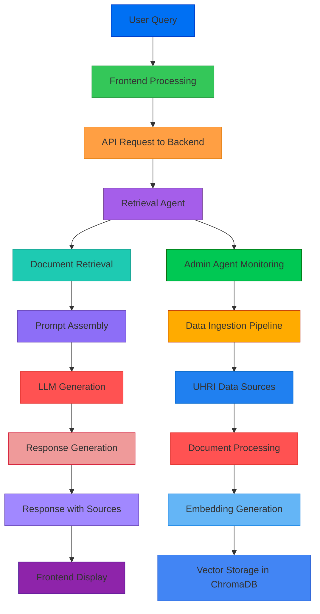

# HRAS - AI/ML Pipeline Documentation

This document provides comprehensive details about the AI and machine learning pipeline used in the HRAS (Human Rights Advisory System).

## Overview

The HRAS system utilizes a sophisticated AI/ML pipeline combining Retrieval-Augmented Generation (RAG) with multi-agent orchestration to provide evidence-based responses to user queries about human rights issues.

## Pipeline Architecture

### 1. High-Level Pipeline Flow



### 2. Component Breakdown

#### 1. Retrieval Component

- **Purpose:** Fetch relevant documents from the vector database
- **Process:**
  1. Receive user query
  2. Generate query embedding using `nomic-embed-text`
  3. Perform vector similarity search in ChromaDB
  4. Rank results by relevance score
  5. Return top-k most relevant documents

#### 2. Generation Component

- **Purpose:** Generate natural language responses using LLMs
- **Process:**
  1. Assemble prompt with retrieved documents
  2. Call Ollama API with `nemotron-3-nano:30b-cloud` model
  3. Generate response with source citations
  4. Format output with structured response

#### 3. Orchestration Component

- **Purpose:** Coordinate multi-agent interactions
- **Implementation:** LangGraph state machine
- **Agents:**
  - Retrieval Agent
  - Generation Agent
  - Admin Agent (for data management)
  - Validation Agent (for quality control)

## RAG Pipeline Details

### 1. Document Processing

1. **Ingestion Pipeline:**
   - Source documents from UHRI (UN Human Rights Index)
   - Process documents through text extraction pipelines
   - Apply chunking strategy (1024 tokens with 20% overlap)
   - Generate embeddings using `nomic-embed-text`
   - Store in ChromaDB vector database

2. **Chunking Strategy:**
   ```python
   def chunk_document(text: str, chunk_size: int = 1024, overlap: float = 0.2) -> List[str]:
       """Split text into overlapping chunks for better retrieval."""
       chunks = []
       for i in range(0, len(text), int(chunk_size * (1 - overlap))):
           chunk = text[i:i + chunk_size]
           chunks.append(chunk)
       return chunks
   ```

### 2. Embedding Generation

- **Model:** `nomic-embed-text` via Ollama
- **Process:**
  ```python
  async def generate_embedding(text: str) -> List[float]:
      """Generate embedding for a given text."""
      response = await ollama.embeddings(
          model="nomic-embed-text",
          prompt=text
      )
      return response["embedding"]
  ```

### 3. Vector Storage Management

- **Database:** ChromaDB
- **Operations:**
  - Create collections for storing document embeddings
  - Perform similarity searches with distance metrics
  - Maintain document metadata (source, timestamp, etc.)
  - Implement collection pruning to manage storage

## Multi-Agent System Architecture

### 1. Agent Roles and Responsibilities

| Agent | Responsibilities | Key Methods |
|-------|------------------|-------------|
| **Retrieval Agent** | Fetch relevant documents | `search_similar()`, `rank_documents()` |
| **Generation Agent** | Generate responses with citations | `generate_response()`, `format_sources()` |
| **Admin Agent** | Manage data ingestion and maintenance | `ingest_data()`, `clear_store()`, `backup_database()` |
| **Validation Agent** | Ensure response quality and compliance | `validate_response()`, `check_factual_consistency()` |

### 2. Workflow Patterns

1. **Single-Agent Workflow:**
   - Simple queries → Retrieval Agent → Generation Agent

2. **Multi-Agent Workflow:**
   - Complex queries → Validation Agent (checks quality) → Retrieval Agent → Generation Agent
   - Data management → Admin Agent ↔ Retrieval Agent

3. **State Machine Architecture:**
   ```python
   from langgraph import StateGraph

   class AgentState(TypedDict):
       query: str
       retrieved_docs: List[str]
       response: str
       conversation_id: str
       sources: List[Dict[str, str]]
       is_streaming: bool

   def create_graph() -> StateGraph:
       graph = StateGraph(AgentState)
       graph.add_node("retrieve", retrieve_node)
       graph.add_node("generate", generate_node)
       graph.add_edge("retrieve", "generate")
       graph.add_edge(START, "retrieve")
       graph.add_edge("generate", END)
       return graph
   ```

## Data Ingestion System

### 1. Pipeline Architecture


### 2. Ingestion Pipeline Steps

1. **Data Acquisition:**
   - Query UHRI API endpoints
   - Download relevant UN documents
   - Handle pagination and rate limiting

2. **Document Processing:**
   - Extract text from PDFs and HTML
   - Apply natural language preprocessing
   - Chunk documents into manageable sections
   - Generate embeddings for each chunk

3. **Vector Storage:**
   - Store embeddings in ChromaDB collections
   - Associate metadata with each document chunk
   - Maintain indexing for fast retrieval

### 3. Automation and Scheduling

- **Trigger Mechanisms:**
  - Manual initiation via API
  - Scheduled jobs (cron)
  - Event-driven (new document available)
  - Deployment-time automatic ingestion

- **Job Management:**
  - Progress tracking and status updates
  - Error handling and retry mechanisms
  - Resource optimization for large-scale ingestion

## Prompt Engineering

### 1. Prompt Structure

The system uses structured prompts that include:

1. **Context Section:** Retrieved relevant documents
2. **Question Section:** User query
3. **Instruction Section:** Response format requirements
4. **Citation Section:** Source attribution requirements

### 2. Example Prompt Template

```python
PROMPT_TEMPLATE = """
You are a UN human rights analyst. Based on the following retrieved documents,
provide a comprehensive response to the user's question. Include citations from
the sources to support your answer.

Retrieved Documents:
{context}

User Question:
{question}

Response Requirements:
1. Provide clear, factual answers based on the evidence
2. Cite sources using the provided format
3. Highlight key recommendations and findings
4. Avoid speculation or unsupported claims
5. Keep response concise but thorough

Generate your response in the following JSON format:
{
  "message": {
    "role": "assistant",
    "content": "Your response here",
    "created_at": "ISO timestamp"
  },
  "sources": [
    {
      "country": "Country Name",
      "mechanism": "UPR/ treaty-body/etc.",
      "year": "YYYY",
      "theme": "Theme of concern",
      "status": "Status",
      "snippet": "Short excerpt from source"
    }
  ]
}
"""
```

## Model Configuration

### 1. LLM Parameters

- **Model:** `nemotron-3-nano:30b-cloud` via Ollama
- **Parameters:**
  ```json
  {
    "temperature": 0.3,
    "max_tokens": 1024,
    "top_p": 0.9,
    "frequency_penalty": 0.1,
    "presence_penalty": 0.1
  }
  ```

### 2. Embedding Model

- **Model:** `nomic-embed-text`
- **Configuration:**
  - Vector dimension: 768
  - Normalization: L2-norm
  - Distance metric: Cosine similarity

## Performance Optimization

### 1. Query Optimization

- **Caching:** Implement response caching for repeated queries
- **Precomputation:** Generate embeddings for common query patterns
- **Parallelization:** Process multiple query components concurrently
- **Index Optimization:** Use HNSW or IVF indices for faster similarity search

### 2. Resource Management

- **Memory Management:** Clean up temporary resources
- **Rate Limiting:** Throttle API calls to prevent overload
- **Backpressure:** Handle spikes in query volume gracefully
- **Monitoring:** Track system performance metrics

## Monitoring and Observability

### 1. Key Metrics

| Metric | Description | Target |
|--------|-------------|--------|
| **Response Latency** | Time from query to response | < 2 seconds |
| **Retrieval Accuracy** | % of relevant documents found | > 90% |
| **System Throughput** | Queries per second | 100+ QPS |
| **Uptime** | System availability | 99.9% |
| **Error Rate** | Failed requests | < 0.1% |

### 2. Logging and Tracing

- **Structured Logging:** JSON-formatted logs with context
- **Distributed Tracing:** Track requests across microservices
- **Metrics Collection:** Prometheus/Grafana integration
- **Alerting:** Configure alerts for critical failures

## Security Considerations

### 1. Data Protection

- **Encryption:** TLS for data in transit
- **Access Controls:** Role-based access to sensitive operations
- **Audit Logs:** Track all data access and modifications
- **Data Retention:** Policies for document lifecycle management

### 2. Model Security

- **Prompt Injection Protection:** Sanitize user inputs
- **Response Filtering:** Prevent harmful or biased outputs
- **Rate Limiting:** Prevent abuse of model APIs
- **Usage Monitoring:** Track model utilization patterns

## Scalability Considerations

### 1. Horizontal Scaling

- **Stateless Services:** Easy to replicate
- **Load Balancing:** Distribute queries across instances
- **Auto-scaling:** Scale based on demand metrics

### 2. Vertical Scaling

- **Resource Allocation:** Upgrade to larger instances
- **Performance Tuning:** Optimize database queries
- **Caching Strategy:** Implement Redis caching for frequent results

### 3. Database Scaling

- **Sharding Strategy:** Distribute data across multiple nodes
- **Replication:** Use read replicas for high-traffic scenarios
- **Connection Pooling:** Manage database connections efficiently

## Cost Management

### 1. Resource Optimization

- **Model Quantization:** Use smaller/quantized models for development
- **Spot Instances:** Utilize discounted cloud instances
- **Scheduled Operations:** Run heavy jobs during off-peak hours

### 2. Monitoring and Alerts

- **Cost Monitoring:** Track API usage and costs
- **Budget Alerts:** Notify when usage exceeds thresholds
- **Usage Reporting:** Provide regular consumption reports

## Future Enhancements

### 1. Pipeline Improvements

- **Real-time Processing:** Stream document ingestion
- **Enhanced Retrieval:** Implement advanced re-ranking techniques
- **Multi-modal Support:** Add image/document analysis capabilities
- **Personalization:** Adapt responses based on user preferences

### 2. Agent Enhancements

- **More Agents:** Add specialized agents for specific tasks
- **Agent Collaboration:** Enable agents to collaborate on complex tasks
- **Dynamic Agent Creation:** Create agents on-the-fly for new tasks
- **Agent Learning:** Allow agents to improve through experience

### 3. Integration Expansions

- **External APIs:** Connect to additional UN data sources
- **Third-party Integrations:** Add specialized knowledge bases
- **API Extensions:** Provide more granular control over pipeline behavior
- **Webhooks:** Enable external systems to trigger pipeline actions
