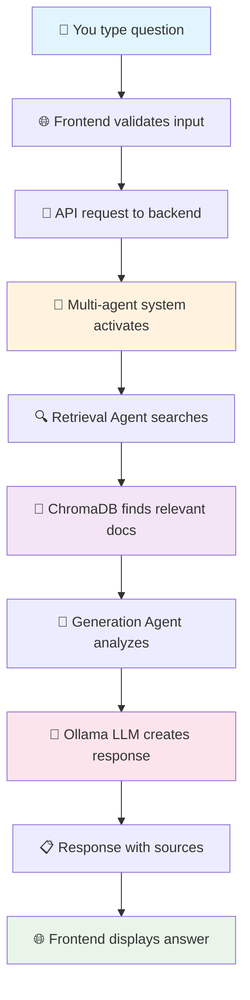

# 🏗️ HRAS System Architecture

*Understanding how HRAS transforms your questions into evidence-based answers*

---

## 🎯 The Big Picture

Imagine HRAS as a smart librarian who:
1. **Listens** to your human rights questions
2. **Searches** through thousands of UN documents instantly
3. **Analyzes** the most relevant information
4. **Synthesizes** an evidence-based answer with proper citations

This happens through three main layers working together seamlessly.

---

## 🏢 Three-Layer Architecture

```
┌─────────────────────────────────────────────────────────┐
│                     🌐 USER LAYER                       │
│           (What you see and interact with)              │
├─────────────────────────────────────────────────────────┤
│  Frontend: Next.js 15 + React 19 + MUI 7              │
│  • Modern web interface                                 │
│  • Real-time conversation display                       │
│  • Source citation visualization                        │
│  • Responsive design for all devices                   │
└─────────────────────────────────────────────────────────┘
                            ⬇️
┌─────────────────────────────────────────────────────────┐
│                   ⚙️ PROCESSING LAYER                    │
│              (Where the intelligence happens)           │
├─────────────────────────────────────────────────────────┤
│  Backend: FastAPI + LangChain + LangGraph              │
│  • RESTful API endpoints                               │
│  • Multi-agent orchestration                          │
│  • Business logic and validation                      │
│  • Conversation management                             │
└─────────────────────────────────────────────────────────┘
                            ⬇️
┌─────────────────────────────────────────────────────────┐
│                    🧠 INTELLIGENCE LAYER                 │
│               (AI and data storage)                     │
├─────────────────────────────────────────────────────────┤
│  AI/ML: Ollama + ChromaDB + Multi-Agent System        │
│  • Document embeddings and search                     │
│  • Large language model reasoning                      │
│  • Source attribution and citations                   │
│  • Vector database for semantic search                │
└─────────────────────────────────────────────────────────┘
```

---

## 🔄 How Your Question Becomes an Answer

### The Journey of a Query

Let's follow what happens when you ask: *"What human rights concerns exist in Kenya?"*



#### Step-by-Step Breakdown

1. **🌐 Frontend Processing** (< 1ms)
   - Validates your input
   - Manages conversation context
   - Sends API request

2. **🔍 Document Retrieval** (200-500ms)
   - Converts question to embedding vector
   - Searches ChromaDB for similar UN documents
   - Ranks results by relevance score

3. **🧠 AI Analysis** (1-3 seconds)
   - LLM analyzes retrieved documents
   - Synthesizes comprehensive response
   - Generates proper source citations

4. **📋 Response Assembly** (< 100ms)
   - Formats answer with metadata
   - Includes conversation tracking
   - Returns structured JSON response

---

## 🎭 Multi-Agent System (The AI Team)

HRAS uses specialized AI agents that work together like a research team:

### 🔍 **Retrieval Agent** - "The Librarian"
**What it does:** Finds relevant UN documents
```python
def retrieve_documents(query: str) -> List[Document]:
    # Convert query to embedding
    # Search vector database
    # Rank by relevance
    # Return top matches
```

### 🧠 **Generation Agent** - "The Analyst"
**What it does:** Creates human-readable answers
```python
def generate_response(docs: List[Document], query: str) -> Response:
    # Analyze document content
    # Synthesize coherent answer
    # Include source citations
    # Format for end user
```

### ⚙️ **Admin Agent** - "The Maintainer"
**What it does:** Manages data ingestion and system health
```python
def ingest_documents() -> IngestionResult:
    # Download UHRI documents
    # Process and chunk content
    # Generate embeddings
    # Store in vector database
```

### ✅ **Validation Agent** - "The Quality Controller"
**What it does:** Ensures response accuracy and compliance
```python
def validate_response(response: Response) -> ValidationResult:
    # Check factual consistency
    # Verify source accuracy
    # Ensure appropriate tone
    # Flag potential issues
```

---

## 💾 Data Architecture

### Document Processing Pipeline

```
UN Documents → Processing → Vector Database → User Queries
     │              │               │              │
     ▼              ▼               ▼              ▼
┌─────────┐  ┌─────────────┐  ┌──────────┐  ┌─────────┐
│ UHRI    │  │ Text        │  │ ChromaDB │  │ Semantic │
│ Sources │→ │ Chunking    │→ │ Storage  │→ │ Search  │
│ • UPR   │  │ • 1024      │  │ • Vector │  │ • Cosine │
│ • Treaty│  │   tokens    │  │   Store  │  │   Sim.   │
│ • Reports│ │ • 20%       │  │ • Meta   │  │ • Top-K  │
│         │  │   overlap   │  │   data   │  │   Results│
└─────────┘  └─────────────┘  └──────────┘  └─────────┘
```

### Vector Database Structure

| Component | Details | Purpose |
|-----------|---------|---------|
| **Collections** | `uhri_recommendations` | Organized document storage |
| **Embeddings** | 768-dimensional vectors | Semantic similarity matching |
| **Metadata** | Country, year, mechanism, theme | Filtering and attribution |
| **Chunks** | 1024 tokens with 20% overlap | Optimal retrieval granularity |

---

## 🚀 Deployment Architecture

### Local Development
```
Your Computer
├── Frontend (Node.js 22+)  → http://localhost:3000
├── Backend (Python 3.12+) → http://localhost:8000
├── ChromaDB (Local)        → ./chroma_db/
└── Ollama (Local)         → http://localhost:11434
```

### Docker Deployment
```
Docker Engine
├── hras-frontend:latest   → Port 3000
├── hras-backend:latest    → Port 8000
├── chromadb/chroma        → Volume mounted
└── ollama/ollama          → Port 11434
```

### Kubernetes (Production-Ready)
```
Kubernetes Cluster (Kind/EKS/GKE)
├── Namespace: hras-system
├── Frontend Deployment    → 3 replicas
├── Backend Deployment     → 3 replicas
├── Ingestion Job         → Automatic data loading
├── ConfigMaps            → Environment-specific config
└── Services              → LoadBalancer/NodePort
```

---

## 🛡️ Security & Reliability

### Security Measures
- **Input Validation**: All user inputs sanitized and validated
- **Rate Limiting**: Prevents abuse and ensures fair usage
- **Network Isolation**: Kubernetes network policies
- **Secret Management**: Environment variables, not hardcoded values

### Reliability Features
- **Health Checks**: Automated monitoring of all services
- **Graceful Degradation**: System remains functional if components fail
- **Auto-scaling**: Kubernetes horizontal pod autoscaling
- **Circuit Breakers**: Prevent cascade failures

---

## ⚡ Performance Characteristics

| Operation | Expected Time | Optimization Strategy |
|-----------|---------------|----------------------|
| **Simple Query** | < 2 seconds | Efficient vector search |
| **Complex Query** | 3-5 seconds | Parallel document processing |
| **Data Ingestion** | 2-10 minutes | Batch processing, progress tracking |
| **System Startup** | 30-60 seconds | Dependency health checks |

### Scalability Targets
- **Concurrent Users**: 100+ simultaneous queries
- **Document Capacity**: 100,000+ UN documents
- **Response Throughput**: 50+ queries per second
- **Storage Growth**: Automatic expansion based on usage

---

## 🔧 Technology Choices Explained

### Why Next.js 15?
- **Server Components**: Faster initial page loads
- **App Router**: Better development experience
- **Built-in Optimization**: Images, fonts, and bundle optimization
- **TypeScript Integration**: Better developer experience

### Why FastAPI?
- **Async/Await**: Handle many requests efficiently
- **Automatic Documentation**: Built-in OpenAPI/Swagger
- **Pydantic Integration**: Automatic request/response validation
- **High Performance**: One of the fastest Python frameworks

### Why Ollama?
- **Local Deployment**: No external API dependencies
- **Cost Effective**: No per-request charges
- **Privacy**: Data never leaves your infrastructure
- **Model Variety**: Support for multiple LLM models

### Why ChromaDB?
- **Purpose-Built**: Designed specifically for AI applications
- **Easy Integration**: Simple Python API
- **Metadata Support**: Rich filtering capabilities
- **Scalability**: Handles large document collections efficiently

---

## 📈 Monitoring & Observability

### Key Metrics Tracked
```
Application Metrics:
├── Response Time      → 95th percentile < 3 seconds
├── Error Rate         → < 0.1% of requests
├── Throughput         → Requests per second
└── Conversation Flow  → Multi-turn success rate

Infrastructure Metrics:
├── CPU Usage          → < 70% average
├── Memory Usage       → < 80% of available
├── Disk I/O           → ChromaDB performance
└── Network Latency    → Service-to-service communication

Business Metrics:
├── Query Categories   → Most common question types
├── Source Usage       → Which documents are most referenced
├── User Satisfaction  → Response quality feedback
└── Knowledge Gaps     → Questions with poor results
```

---

## 🔄 Future Evolution

### Short Term (Next 3 months)
- **Streaming Responses**: Real-time answer generation
- **Advanced Filtering**: Filter by date, country, mechanism
- **Performance Optimization**: Sub-second response times
- **Enhanced Monitoring**: Detailed metrics dashboard

### Medium Term (6-12 months)
- **Multi-language Support**: Questions and responses in multiple languages
- **Advanced Analytics**: Query pattern analysis and recommendations
- **Integration APIs**: Connect with external UN systems
- **Mobile Applications**: Native iOS and Android apps

### Long Term (1+ years)
- **Predictive Analysis**: Trend identification and forecasting
- **Knowledge Graphs**: Enhanced relationship modeling
- **Real-time Updates**: Live document processing as UN publishes
- **AI Training**: Custom models trained on organization-specific data

---

## 🎓 Architecture Learning Resources

- **LangChain Documentation**: https://python.langchain.com/
- **LangGraph Tutorials**: https://python.langchain.com/docs/langgraph
- **ChromaDB Guide**: https://docs.trychroma.com/
- **Ollama Documentation**: https://github.com/ollama/ollama
- **FastAPI Tutorial**: https://fastapi.tiangolo.com/tutorial/
- **Next.js Guide**: https://nextjs.org/docs
