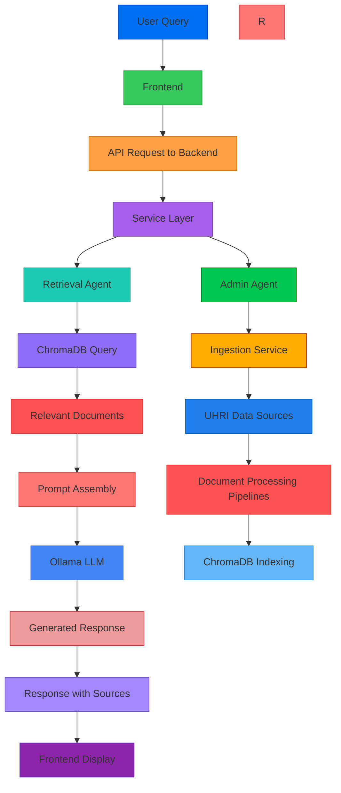

# HRAS - Architecture Overview

## System Architecture

The HRAS (Human Rights Advisory System) uses a layered architecture with specific patterns for scalability, maintainability, and clear separation of concerns.

```
┌──────────────────────────────────────────────────────────────────────┐
│                      HRAS High-Level Architecture                    │
├─────────────────────┬───────────────────────┬─────────────────────┤
│  Frontend           │      Backend          │      AI/ML          │
│  (Next.js 15)       │  (FastAPI)            │  (LangChain/LangGraph)│
├─────────────────────┼───────────────────────┼─────────────────────┤
│  Components         │      Services         │      Components     │
│  - UI Components    │      - Business Logic │      - Retrieval    │
│  - State Management │      - API Routing    │      - Generation   │
│  - Forms            │      - Data Access    │      - Embeddings   │
│  - Routing          │      - Security       │      - Vector DB    │
├─────────────────────┼───────────────────────┼─────────────────────┤
│  External Services  │      Infrastructure   │      Infrastructure │
│  - Ollama API       │      - Database       │      - Storage      │
│  - ChromaDB         │      - Redis Cache    │      - Authentication│
└─────────────────────┴───────────────────────┴─────────────────────┘
```

## Component Diagram

### 1. Frontend Layer (Next.js 15)
- ** Technologies: React 19, MUI 7, TailwindCSS 4
- **Key Features:**
  - App Router architecture
  - Server Components for data fetching
  - Client Components for interactivity
  - Form handling with react-hook-form + zod
  - State management with React Query
  - Accessibility-first design

### 2. Backend Layer (FastAPI)
- **Technologies:** Python 3.12+, FastAPI, SQLAlchemy, Pydantic v2
- **Key Features:**
  - 4-layer architecture: API Routes → Services → Repositories → Models
  - Dependency Injection pattern
  - Async I/O operations throughout
  - Pydantic v2 for data validation
  - Type-safe API contracts

### 3. AI/ML Layer (LangChain + LangGraph + Ollama)
- **Technologies:** LangChain, LangGraph, Ollama, ChromaDB
- **Key Components:**
  - **Retrieval Component:** 
    - Uses `nomic-embed-text` for embeddings
    - ChromaDB for vector storage and retrieval
    - Relevance scoring for document ranking
  - **Generation Component:** 
    - Uses `nemotron-3-nano:30b-cloud` via Ollama
    - Prompt engineering for response generation
    - Source citation and attribution system
  - **Orchestration Component:**
    - LangGraph for multi-agent coordination
    - State machine for conversation flow
    - Tool calling for external APIs

### 4. Data Flow



## Multi-Agent System Architecture

The system employs a multi-agent orchestration pattern using LangGraph:

### Agent Roles:
1. **Retrieval Agent** - Fetches relevant documents from ChromaDB
2. **Generation Agent** - Generates responses using LLM
3. **Admin Agent** - Handles data ingestion and maintenance
4. **Validation Agent** - Ensures response quality and compliance

### Workflow:
1. User submits query to frontend
2. Frontend sends request to backend API
3. Backend routes request to Retrieval Agent
4. Retrieval Agent queries ChromaDB for relevant documents
5. Retrieved documents are passed to Generation Agent
6. Generation Agent creates response with source citations
7. Response is returned to frontend for display

## Deployment Architecture

### 1. Local Development
- Docker Compose for service isolation
- Hot reload for development
- Separate process for frontend and backend

### 2. Docker Deployment
- Multi-stage Docker builds
- Separate images for frontend and backend
- Volume mounting for code and data
- Health checks for all services

### 3. Kubernetes Deployment (Kind)
- Ardan Labs pattern for Kustomize overlays
- Separate base and overlay manifests
- Automatic data ingestion on first deployment
- Configuration management via ConfigMaps
- Network policies for service isolation

## Key Design Decisions

1. **RAG Pipeline Design:**
   - Document chunking strategy (1024 tokens with 20% overlap)
   - Relevance scoring using cosine similarity
   - Source tracking and attribution in responses

2. **Multi-Agent Orchestration:**
   - LangGraph state machine for conversation flow
   - Role-based agent specialization
   - Tool calling pattern for extensibility

3. **Data Ingestion System:**
   - Automated pipeline triggered on deployment
   - Sample data for testing, full dataset for production
   - Progress tracking and status reporting

4. **Type Safety:**
   - Strict type hints in Python backend
   - TypeScript interfaces in frontend
   - Pydantic and Zod validation for API contracts