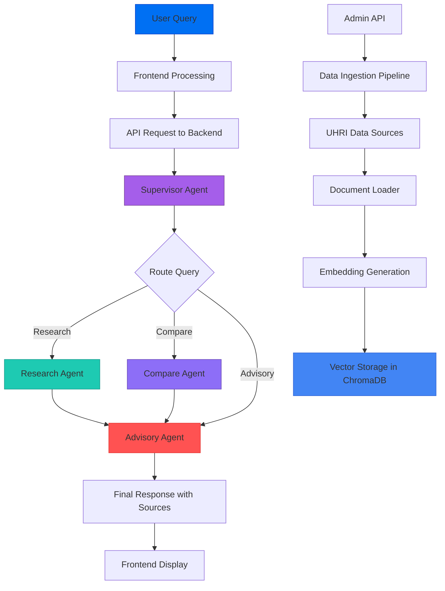
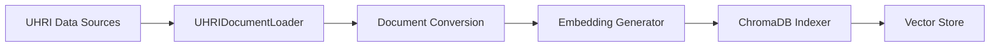

# HRAS - AI/ML Pipeline Documentation

This document provides comprehensive details about the AI and machine learning pipeline used in the HRAS (Human Rights Advisory System).

> **See Also:** [Architecture Diagrams](./DIAGRAMS.md) for visual representations of the system.

## Overview

The HRAS system utilizes a sophisticated AI/ML pipeline combining Retrieval-Augmented Generation (RAG) with multi-agent orchestration to provide evidence-based responses to user queries about human rights issues.

## Pipeline Architecture

### 1. High-Level Pipeline Flow



### 2. Component Breakdown

#### 1. Retrieval Component

- **Purpose:** Fetch relevant documents from the vector database
- **Process:**
  1. Receive user query from agent tools
  2. Generate query embedding using `nomic-embed-text`
  3. Perform vector similarity search in ChromaDB
  4. Rank results by relevance score
  5. Return top-k most relevant documents with metadata

#### 2. Generation Component

- **Purpose:** Generate natural language responses using LLMs
- **Process:**
  1. Assemble prompt with retrieved documents
  2. Call Ollama API with `nemotron-3-nano:30b-cloud` model
  3. Generate response with source citations
  4. Format output with structured response

#### 3. Orchestration Component

- **Purpose:** Coordinate multi-agent interactions
- **Implementation:** LangGraph state machine with supervisor pattern
- **Agents:**
  - **Supervisor Agent** - Routes queries to appropriate specialized agent
  - **Research Agent** - Document search and retrieval, creates research summaries
  - **Advisory Agent** - Generates final advisory responses with citations
  - **Compare Agent** - Cross-country analysis and comparison

## RAG Pipeline Details

### 1. Document Processing

1. **Ingestion Pipeline:**
   - Source documents from UHRI (UN Human Rights Index)
   - Convert UHRI JSON records directly to LangChain Documents (no chunking)
   - Generate embeddings using `nomic-embed-text`
   - Store in ChromaDB vector database with metadata

2. **Document Conversion:**
   ```python
   def _build_document_content(self, record: dict) -> str:
       """Build searchable text content from a UHRI record."""
       parts = []
       parts.append(f"Country: {record.get('country', 'Unknown')}")

       mechanism = record.get("mechanism", "")
       if mechanism:
           mechanism_info = f"Mechanism: {mechanism}"
           if cycle := record.get("cycle"):
               mechanism_info += f" ({cycle})"
           if year := record.get("year"):
               mechanism_info += f", Year: {year}"
           parts.append(mechanism_info)

       if theme := record.get("theme"):
           parts.append(f"Theme: {theme}")

       if recommendation := record.get("recommendation"):
           parts.append(f"Recommendation: {recommendation}")

       if status := record.get("status"):
           parts.append(f"Status: {status}")

       return "\n".join(parts)
   ```

### 2. Embedding Generation

- **Model:** `nomic-embed-text` via Ollama
- **Process:**
  ```python
  from langchain_ollama import OllamaEmbeddings

  embeddings = OllamaEmbeddings(
      base_url=settings.ollama_base_url,
      model=settings.ollama_embedding_model,  # nomic-embed-text
  )
  ```

### 3. Vector Storage Management

- **Database:** ChromaDB
- **Operations:**
  - Create collections for storing document embeddings
  - Perform similarity searches with distance metrics
  - Maintain document metadata (country, mechanism, year, theme, status)
  - Support filtering by metadata fields

## Multi-Agent System Architecture

### 1. Agent Roles and Responsibilities

| Agent | Responsibilities | Key Functions |
|-------|------------------|---------------|
| **Supervisor Agent** | Classify queries and route to appropriate agent | `supervisor_node()` |
| **Research Agent** | Search UHRI database, create research summaries | `research_agent()`, uses `search_recommendations`, `get_country_recommendations` |
| **Advisory Agent** | Generate final advisory responses with citations | `advisory_agent()` |
| **Compare Agent** | Cross-country analysis and pattern identification | `compare_agent()`, uses `compare_countries` |

### 2. AgentState Schema

The shared state that flows through the LangGraph workflow:

```python
from pydantic import BaseModel, Field
from typing import Annotated, Literal
from langchain_core.messages import BaseMessage
from langgraph.graph.message import add_messages

class Source(BaseModel):
    """A source document reference."""
    country: str = ""
    mechanism: str = ""
    year: str = ""
    theme: str = ""
    status: str = ""
    snippet: str = ""
    relevance_score: float = 0.0

class AgentState(BaseModel):
    """Shared state for the multi-agent workflow."""

    # User input
    question: str = Field(default="", description="The user's question")

    # Conversation history
    messages: Annotated[list[BaseMessage], add_messages] = Field(
        default_factory=list,
        description="Conversation message history",
    )

    # Retrieved documents and sources
    retrieved_docs: list[dict] = Field(default_factory=list)
    sources: list[Source] = Field(default_factory=list)

    # Agent routing
    next_agent: Literal["research", "advisory", "compare", "supervisor", "end"] = "supervisor"
    query_type: Literal["research", "advisory", "compare", "general"] = "general"

    # Context for specific agent tasks
    countries: list[str] = Field(default_factory=list)
    themes: list[str] = Field(default_factory=list)
    time_range: tuple[str, str] | None = None

    # Generated outputs
    research_summary: str = ""
    advisory_response: str = ""
    comparison_result: str = ""
    final_response: str = ""

    # Error handling
    error: str | None = None
```

### 3. Workflow Patterns

1. **Supervisor Pattern (Entry Point):**
   - All queries first go to Supervisor Agent
   - Supervisor classifies query type and extracts entities
   - Routes to appropriate specialized agent

2. **Research Workflow:**
   ```
   Supervisor → Research Agent → Advisory Agent → END
   ```
   - For factual questions about recommendations

3. **Compare Workflow:**
   ```
   Supervisor → Compare Agent → Advisory Agent → END
   ```
   - For cross-country analysis questions

4. **Direct Advisory Workflow:**
   ```
   Supervisor → Advisory Agent → END
   ```
   - For guidance questions or simple greetings

5. **State Machine Architecture:**
   ```python
   from langgraph.graph import END, StateGraph

   def build_graph() -> StateGraph:
       """Build the multi-agent LangGraph workflow."""
       workflow = StateGraph(AgentState)

       # Add nodes
       workflow.add_node("supervisor", supervisor_node)
       workflow.add_node("research", research_agent)
       workflow.add_node("advisory", advisory_agent)
       workflow.add_node("compare", compare_agent)

       # Set entry point
       workflow.set_entry_point("supervisor")

       # Add conditional edges from supervisor
       workflow.add_conditional_edges(
           "supervisor",
           route_to_agent,
           {
               "research": "research",
               "advisory": "advisory",
               "compare": "compare",
           },
       )

       # Research agent routes to advisory
       workflow.add_conditional_edges(
           "research",
           route_to_agent,
           {"advisory": "advisory", "end": END},
       )

       # Compare agent routes to advisory
       workflow.add_conditional_edges(
           "compare",
           route_to_agent,
           {"advisory": "advisory", "end": END},
       )

       # Advisory agent ends the workflow
       workflow.add_conditional_edges(
           "advisory",
           route_to_agent,
           {"end": END},
       )

       return workflow
   ```

## Data Ingestion System

### 1. Pipeline Architecture



### 2. Ingestion Pipeline Steps

1. **Data Acquisition:**
   - Query UHRI API endpoints (or use sample data)
   - Download relevant UN recommendations
   - Handle pagination and rate limiting

2. **Document Processing:**
   - Convert UHRI JSON records to LangChain Documents
   - No chunking - each UHRI record becomes one document
   - Extract metadata (country, mechanism, year, theme, status)
   - Generate embeddings for each document

3. **Vector Storage:**
   - Store embeddings in ChromaDB collection
   - Associate metadata with each document
   - Maintain indexing for fast retrieval

### 3. Automation and Scheduling

- **Trigger Mechanisms:**
  - Manual initiation via Admin API (`POST /api/v1/admin/ingest`)
  - Clear and re-ingest option available
  - Sample data ingestion for development

## Prompt Engineering

### 1. Prompt Structure

The system uses role-specific prompts for each agent:

1. **Supervisor Prompt:** Query classification and entity extraction
2. **Research Prompt:** Document search and summarization
3. **Advisory Prompt:** Final response generation with citations
4. **Compare Prompt:** Cross-country analysis formatting

### 2. Supervisor Agent Prompt

```python
SUPERVISOR_SYSTEM_PROMPT = """You are a supervisor agent that routes human rights queries to specialized agents.

Analyze the user's question and classify it:

1. **research** - Factual questions about recommendations, documents, or situations
   - "What recommendations exist for Kenya?"
   - "Tell me about UPR recommendations on torture"

2. **compare** - Questions comparing countries or analyzing patterns
   - "Compare human rights in Kenya and Tanzania"
   - "What are the common themes across African countries?"

3. **advisory** - Questions seeking guidance or synthesis
   - "What should we focus on for the upcoming review?"
   - Simple greetings or general questions

Also extract:
- Countries mentioned (if any)
- Themes mentioned (e.g., torture, discrimination, freedom of expression)

Respond in JSON format:
{
  "query_type": "research" | "compare" | "advisory",
  "countries": ["country1", "country2"],
  "themes": ["theme1", "theme2"],
  "requires_comparison": true | false,
  "reasoning": "Brief explanation of classification"
}"""
```

### 3. Simple RAG Prompt Template

```python
SIMPLE_RAG_PROMPT = ChatPromptTemplate.from_template(
    """You are a Human Rights Advisory Assistant. Answer the question based on the following context from the UN Human Rights Index.

Context:
{context}

Question: {question}

Provide a helpful, accurate response based on the context. Cite specific recommendations when relevant. If the context doesn't contain enough information to fully answer the question, acknowledge this clearly.

Answer:"""
)
```

## Model Configuration

### 1. LLM Parameters

- **Model:** `nemotron-3-nano:30b-cloud` via Ollama
- **Configuration:**
  ```python
  from langchain_ollama import ChatOllama

  def get_llm(temperature: float = 0.1) -> BaseChatModel:
      return ChatOllama(
          base_url=settings.ollama_base_url,
          model=settings.ollama_model,
          temperature=temperature,
      )

  def get_deterministic_llm() -> BaseChatModel:
      """Temperature 0.0 for consistent outputs (supervisor routing)."""
      return get_llm(temperature=0.0)

  def get_creative_llm() -> BaseChatModel:
      """Temperature 0.7 for more varied responses."""
      return get_llm(temperature=0.7)
  ```

### 2. Embedding Model

- **Model:** `nomic-embed-text`
- **Configuration:**
  - Vector dimension: 768
  - Distance metric: Cosine similarity
  - Served via Ollama

## Performance Optimization

### 1. Query Optimization

- **Caching:** LRU cache on LLM factory functions
- **Singleton Pattern:** Compiled graph reused across requests
- **Parallelization:** Async tool execution with `use_async_tools` flag

### 2. Resource Management

- **Timeout Configuration:** Configurable via `OLLAMA_TIMEOUT` (default: 180s)
- **Connection Pooling:** Managed by httpx/aiohttp clients
- **Memory Management:** ChromaDB persistence to disk

## Monitoring and Observability

### 1. Prometheus Metrics

| Metric | Description |
|--------|-------------|
| `agent_executions_total` | Total agent executions by agent name and status |
| `agent_execution_duration_seconds` | Execution time histogram by agent |
| `agent_steps_total` | Workflow steps by agent and type |
| `llm_requests_total` | LLM API calls by model and status |
| `llm_request_duration_seconds` | LLM request latency |
| `vectorstore_operations_total` | Vector store operations by type |
| `errors_total` | Error count by type and component |

### 2. Structured Logging

- **Library:** structlog
- **Format:** JSON structured logs
- **Context:** Agent name, execution time, step count, errors

### 3. LangSmith Tracing (Optional)

- Distributed tracing for agent workflows
- Parent/child run tracking
- Production evaluators for quality assessment

## Security Considerations

### 1. Data Protection

- **Encryption:** TLS for data in transit (Caddy reverse proxy)
- **Access Controls:** Admin endpoints require authentication
- **Audit Logs:** Structured logging of all operations

### 2. Model Security

- **Prompt Injection Protection:** Structured prompts with clear role definitions
- **Response Filtering:** Agent-level validation
- **Rate Limiting:** Configurable via CORS and API middleware

## Scalability Considerations

### 1. Horizontal Scaling

- **Stateless Services:** API layer is stateless
- **Shared Vector Store:** ChromaDB can be shared across instances
- **Load Balancing:** Supported via Caddy or external LB

### 2. Database Scaling

- **ChromaDB:** Persistence directory configurable
- **PostgreSQL:** Optional for conversation persistence
- **Connection Pooling:** Async SQLAlchemy with pooling

## Future Enhancements

### 1. Pipeline Improvements

- **Streaming Responses:** Real-time token streaming
- **Enhanced Retrieval:** Re-ranking and hybrid search
- **Multi-modal Support:** Document analysis capabilities

### 2. Agent Enhancements

- **Memory:** Long-term conversation memory
- **Tool Extensions:** Additional UHRI API integrations
- **Evaluation:** Automated quality scoring
