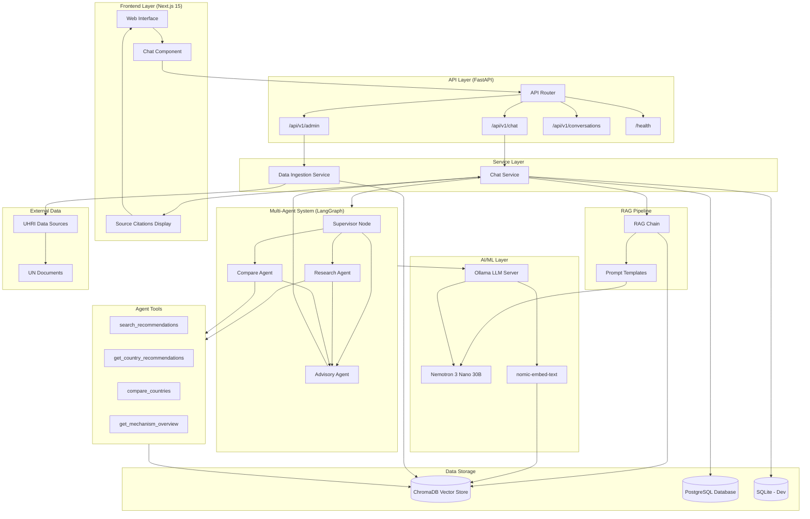
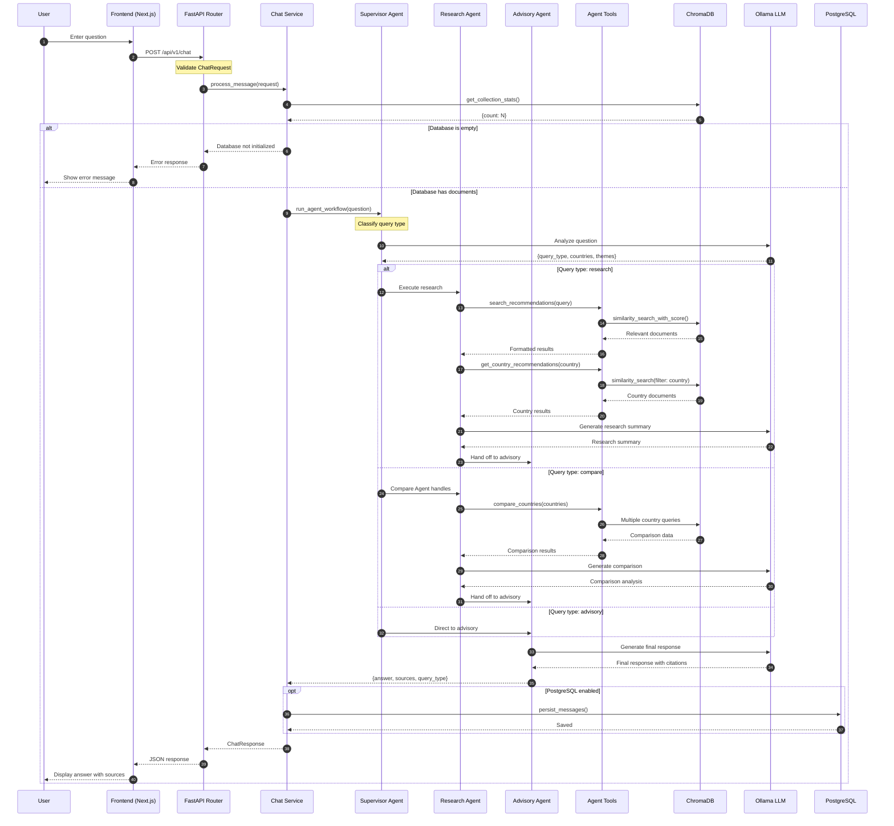
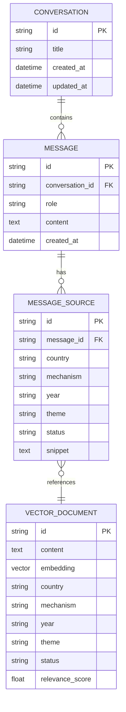
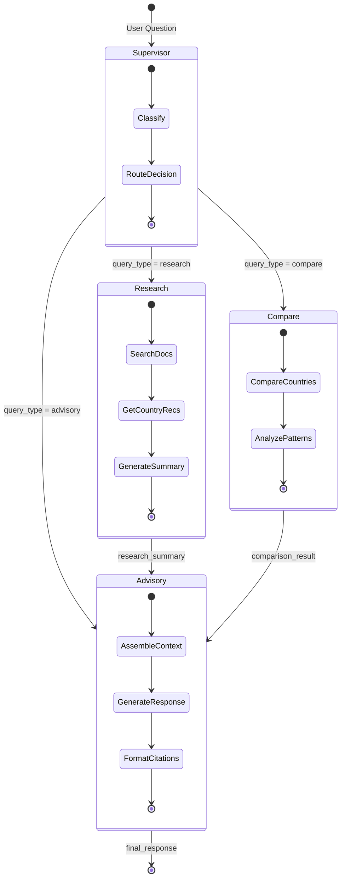
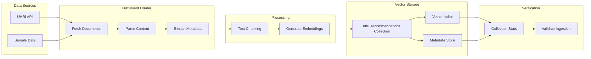

# HRAS System Diagrams

This document contains visual diagrams explaining the HRAS (Human Rights Advisory System) architecture, data flow, and database structure.

> **SVG files are available in:** `docs/architecture/diagrams/`

---

## 1. System Flowchart

This flowchart shows the high-level system architecture and how components interact.


<details>
<summary>View Mermaid Source</summary>



</details>

---

## 2. Sequence Diagram

This sequence diagram shows the complete request/response flow when a user asks a question.


<details>
<summary>View Mermaid Source</summary>



</details>

---

## 3. Entity Relationship Diagram

This ER diagram shows the database schema and relationships between entities.


<details>
<summary>View Mermaid Source</summary>



</details>

### Database Schema Details

| Table | Column | Type | Description |
|-------|--------|------|-------------|
| **CONVERSATION** | id | UUID | Primary key |
| | title | VARCHAR(255) | Conversation title |
| | created_at | TIMESTAMP | Creation time (with timezone) |
| | updated_at | TIMESTAMP | Last update (auto-update) |
| **MESSAGE** | id | UUID | Primary key |
| | conversation_id | UUID (FK) | References CONVERSATION |
| | role | VARCHAR(20) | "user" or "assistant" |
| | content | TEXT | Message text |
| | created_at | TIMESTAMP | Creation time |
| **MESSAGE_SOURCE** | id | UUID | Primary key |
| | message_id | UUID (FK) | References MESSAGE |
| | country | VARCHAR(100) | Country name |
| | mechanism | VARCHAR(100) | UPR, CERD, CAT, etc. |
| | year | VARCHAR(10) | Document year |
| | theme | VARCHAR(255) | Human rights theme |
| | status | VARCHAR(50) | Recommendation status |
| | snippet | TEXT | Document excerpt |

---

## 4. Multi-Agent Workflow Diagram

This diagram shows the LangGraph multi-agent orchestration workflow.


<details>
<summary>View Mermaid Source</summary>



</details>

### Agent Responsibilities

| Agent | Role | Key Actions |
|-------|------|-------------|
| **Supervisor** | Query classifier and router | Analyzes question, extracts countries/themes, routes to appropriate agent |
| **Research Agent** | Document retrieval and summarization | Searches vector store, retrieves country-specific recommendations, generates research summary |
| **Compare Agent** | Cross-country analysis | Compares recommendations across countries, identifies patterns |
| **Advisory Agent** | Response generation | Synthesizes final response with citations, ensures professional UN-style language |

---

## 5. Data Ingestion Pipeline

This flowchart shows how UN documents are ingested into the vector store.


<details>
<summary>View Mermaid Source</summary>



</details>

### Ingestion Configuration

| Parameter | Value | Description |
|-----------|-------|-------------|
| Chunk Size | 1024 tokens | Optimal size for retrieval |
| Overlap | 20% | Prevents context loss at boundaries |
| Embedding Model | nomic-embed-text | Via Ollama |
| Vector Dimension | 768 | Embedding dimensions |
| Distance Metric | Cosine similarity | For relevance ranking |

---

## 6. API Architecture

This diagram shows the API layer structure and middleware stack.


<details>
<summary>View Mermaid Source</summary>

```mermaid
flowchart TB
    subgraph Client["Client"]
        Browser[Web Browser]
        API_Client[API Client]
    end

    subgraph Middleware["Middleware Stack"]
        CORS[CORS Middleware]
        Security[Security Headers]
        Logging[Request Logging]
        Metrics[Prometheus Metrics]
        TrustedHost[Trusted Host]
    end

    subgraph Routes["API Routes"]
        Health[/health]
        Chat[/api/v1/chat]
        Admin[/api/v1/admin]
        Conv[/api/v1/conversations]
        MetricsEnd[/metrics]
    end

    subgraph Handlers["Route Handlers"]
        HealthCheck[Health Check]
        ChatHandler[Chat Handler]
        IngestHandler[Ingest Handler]
        StatsHandler[Stats Handler]
        ConvHandler[Conversation CRUD]
    end

    Browser --> CORS
    API_Client --> CORS
    CORS --> Security
    Security --> Logging
    Logging --> Metrics
    Metrics --> TrustedHost
    TrustedHost --> Routes

    Health --> HealthCheck
    Chat --> ChatHandler
    Admin --> IngestHandler
    Admin --> StatsHandler
    Conv --> ConvHandler
    MetricsEnd --> Metrics
```

</details>

### API Endpoints Summary

| Endpoint | Method | Description |
|----------|--------|-------------|
| `/health` | GET | Health check and readiness probe |
| `/api/v1/chat` | POST | Process chat message through RAG pipeline |
| `/api/v1/admin/ingest` | POST | Ingest documents into vector store |
| `/api/v1/admin/stats` | GET | Get vector store statistics |
| `/api/v1/conversations` | GET | List all conversations |
| `/api/v1/conversations/{id}` | GET/DELETE | Get or delete conversation |
| `/metrics` | GET | Prometheus metrics endpoint |

---

## File Locations

All SVG diagram files are located in:

```
docs/architecture/diagrams/
├── 01-system-flowchart.svg
├── 02-sequence-diagram.svg
├── 03-entity-relationship.svg
├── 04-multi-agent-workflow.svg
├── 05-data-ingestion-pipeline.svg
└── 06-api-architecture.svg
```

---

## Related Documentation

- [Architecture Overview](./ARCHITECTURE.md) - Detailed system architecture
- [AI/ML Pipeline](./AI_ML.md) - RAG and multi-agent details
- [API Reference](../reference/API.md) - REST endpoint documentation
